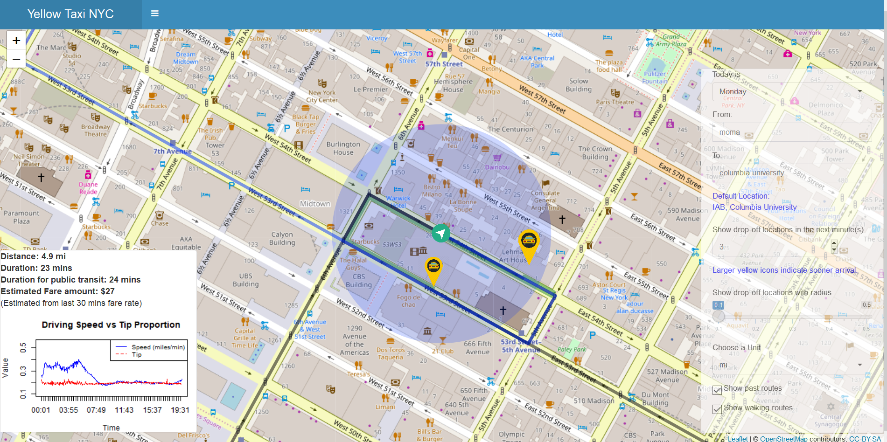
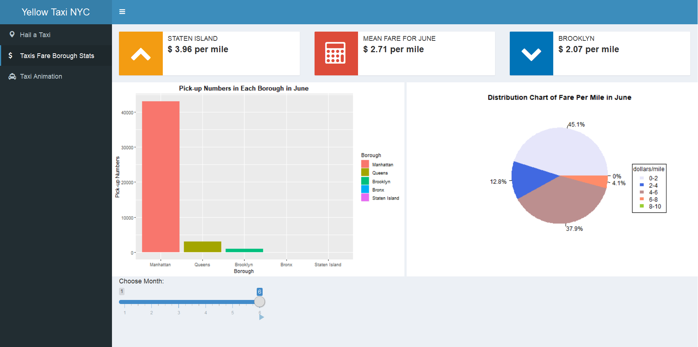
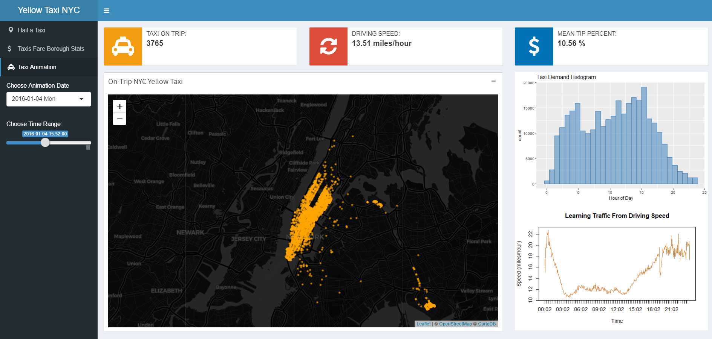

# Project 2: Shiny App_Hi Taxi!
####Project Description

In this second project of GR5243 Applied Data Science, we developed a shiny app on the topic of **where and whether to get a taxi** using [2016 Yellow Taxi Trip Data](https://data.cityofnewyork.us/Transportation/2016-Yellow-Taxi-Trip-Data/k67s-dv2t) from [NYC Open Data](https://opendata.cityofnewyork.us/). See [Project 2 Description](doc/project2_desc.md) for more details.  




##Hi Taxi! App
Term: Fall 2018

+ Team #11
+ **Project Title:** Hi Taxi!
 + App [Link](https://judycom.shinyapps.io/yellowtaxinyc/)
 (Due to the huge size of the data files, it may be slow for the app the read in and display. To use the app, please download or clone the master branch and unzip all the data files in the folder "data". It may also take a while for the map screen to display also because of the size of the data. We once tried to sample the data and obtain only a subset of them, but that would result in an effect not quite credible, i.e. showing too few taxi drop-off points in a certain sphere and in a certain time period, for example, in 0.2 miles in the next 5 minutes. Compared with the loading time at the beginning, we think the visualization effect is more important, so we decide to retain the original data, which may impair the shinyapp.io funtionality. 
 
 + Team Members
	+ Huiming Xie
	+ Wening Yu
	+ Fangqi Ouyang
	+ Izzy Beers
	+ Siyu Zhu (Presenter)

+ **Project summary**: "Where to go to get a taxi?" is always a problem faced by people who want to get a cab, especially when there is no uber around. 

 Given your current location, our app Hi Taxi! can show you neighboring taxi which will drop off in the following few minutes based on the past records. The app also provides choices for user to choose from Monday - Sunday to see different trafftic patterns for a week. The details along with the information for walking to the dropoff locations can be shown by clicking on the taxi location icons. Besides this, Hi Taxi! will also present you with the optimal taxi route from your location to your destination, along with the estimated distance, duration and fare amount. It will also provide the public trasit duration for your reference. Of course, since we only have the data for 2016, the drop-off locations are not real-time, but the functioning can be viewed from the app, and as long as the real-time data can be obtained for the current time, the app can provide great business value. And The 2nd and 3rd dashboards provide some summary statistics and overview of the data in different boroughs and different time points.

+ **Contribution statement**: All team members contributed to the GitHub repository and prepared for the presentation. All team members were actively involved in all stages of this project and helped design the app. All team members approve of the work presented in our GitHub repository including this contribution statement.

 + Huiming Xie: Project Leader. Main contributor of the "hail a taxi" panel. Coordinated and combined ideas of group members. Organized and merged code written by different members. Actively communicated with group members to push forward progress of the project 
 + Siyu Zhu: Preprocessed data. Designed ui and server to localized passenger, and to mark the neighboring taxi on the map. Organized Github. Presented in class. 
 + Wening Yu: 1.Second contributor of the "hail a taxi" panel. Achieved functionalities included: click on map showing destination, enter or select destination and current location, visualize the route, designed functions to calculate estimated trip duration/ tip percent/ total fare/etc., rush hour plot design. 2.Taxi animation dashboard design and functionality implementation

 + Fangqi Ouyang: Designed taxi borough statistics dashboard
 + Izzy Beers: Randomly subsetted data from 100 million rows per month to 80,000 rows per month, for a total dataset size of about one million rows, to make processing easier in R.  Created function to tell you where exactly taxis usually drop people off near your location, at that time of day, so you can find the best place to wait for a taxi.


Following [suggestions](http://nicercode.github.io/blog/2013-04-05-projects/) by [RICH FITZJOHN](http://nicercode.github.io/about/#Team) (@richfitz). This folder is orgarnized as follows.

```
/
 app/
”€ lib/
 data/
”€ doc/
”€ output/
```

Please see each subfolder for a README file.

